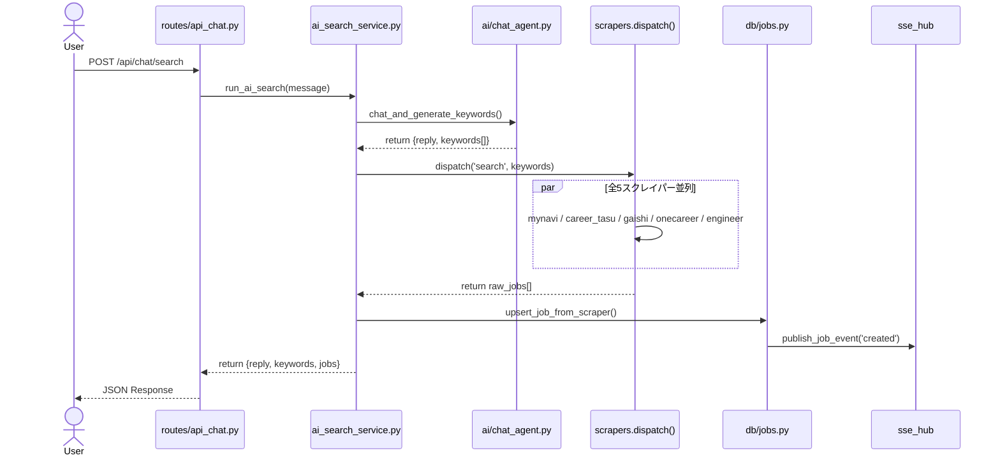
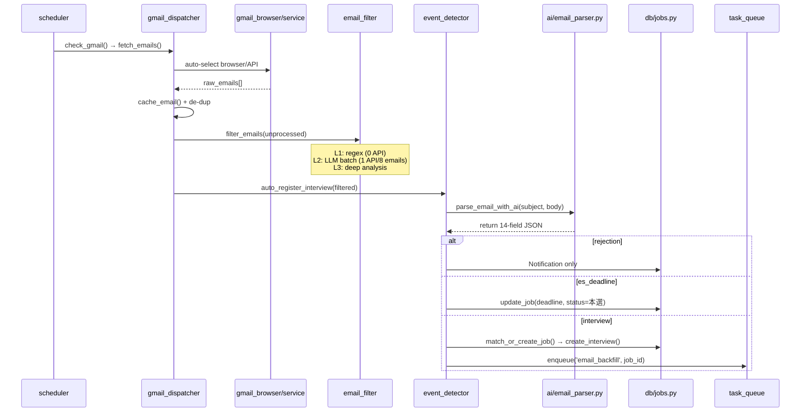
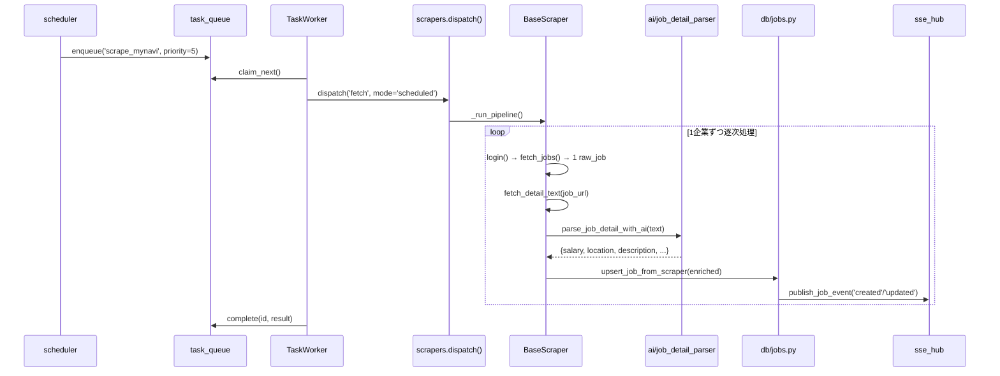
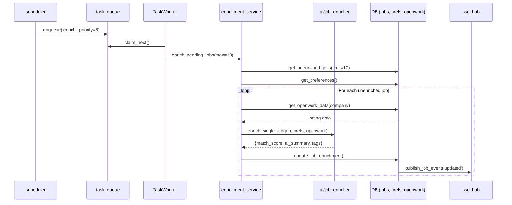
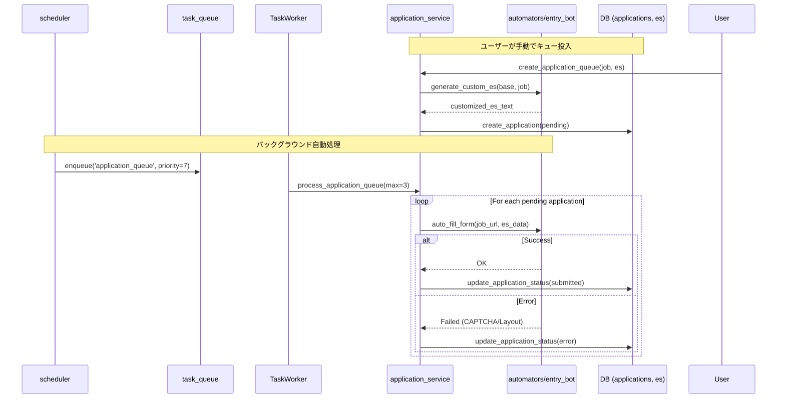
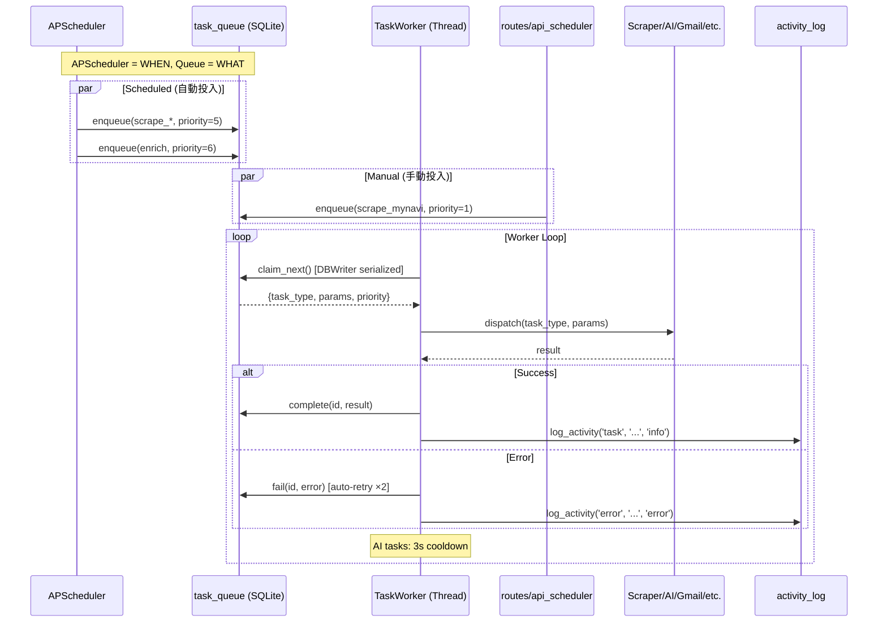

# 就活エージェント システムアーキテクチャ
# 最終更新: 2026-03-01

---

## プロジェクト構成図

```
shukatsu-agent/
├── app.py                  # Flask アプリ + ページルート（8画面）
├── config.py               # 全設定（.env + app_config.ini）
├── database.py             # 後方互換 shim（re-exports db/*）
├── gmail_browser.py        # Cookie経由Gmail取得（Playwright、統一fetch_emails_by_search）
├── gmail_service.py        # OAuth2経由Gmail取得（query+分ページ対応）
├── ai_parser.py            # 旧AI shim（re-exports ai/）
│
├── ai/                     # 🧠 AI/LLM 層
│   ├── __init__.py         #   call_llm(), is_ai_configured(), clean_json_response()
│   ├── adapters.py         #   Gemini / OpenAI / DeepSeek アダプター
│   ├── ai_merge.py         #   統一AIマージ（ai_merge() — 全データ結合の単一関数）
│   ├── dispatcher.py       #   LLMDispatcher: キー管理 + 優先度ルーティング
│   ├── prompt_loader.py    #   prompts/*.txt 読み込み + 自動生成
│   ├── chat_agent.py       #   チャット → キーワード生成
│   ├── email_parser.py     #   メール構造化解析（14フィールド）
│   ├── job_detail_parser.py#   求人詳細ページAI解析（9フィールド）
│   ├── job_enricher.py     #   スコアリング（match_score, ai_summary, tags）
│   └── es_writer.py        #   企業別ES自動生成
│
├── db/                     # 💾 データベース層
│   ├── __init__.py         #   get_db(), get_db_connection(), get_db_read(), DBWriter, init_db()
│   ├── models.py           #   TypedDict型定義（JobRecord, InterviewRecord, TaskRecord等）
│   ├── jobs.py             #   求人CRUD + upsert_job_from_scraper()
│   ├── interviews.py       #   面接CRUD
│   ├── emails.py           #   メールキャッシュ
│   ├── applications.py     #   応募管理
│   ├── es.py               #   ES文書（photo_path対応）
│   ├── chat.py             #   チャット履歴
│   ├── notifications.py    #   通知
│   ├── preferences.py      #   ユーザー希望条件
│   ├── user_profile.py     #   プロフィール
│   ├── mypages.py          #   マイページ認証情報
│   ├── openwork.py         #   OpenWorkキャッシュ
│   ├── llm_settings.py     #   APIキー(AES暗号化) + ワークフロー設定
│   ├── gmail_settings.py   #   Gmail設定管理（last_fetched_at, backfill_days等）
│   ├── task_queue.py       #   タスクキュー（priority, status, retry）
│   └── activity_log.py     #   構造化イベントログ
│
├── services/               # ⚙️ ビジネスロジック層
│   ├── __init__.py         #   ユーティリティ（企業名抽出、日付解析等）
│   ├── event_detector.py   #   メール→AI→面接/ES/rejection自動処理
│   ├── email_filter.py     #   3層メールフィルタ（regex→LLM batch→deep）
│   ├── email_backfill.py   #   メール企業のスクレイパー補完
│   ├── gmail_dispatcher.py #   Gmail統一取得（モードレジストリ経由、browser/API自動選択）
│   ├── gmail_modes.py      #   FetchModeレジストリ（backfill/incremental/keyword_search + 拡張可能）
│   ├── ai_search_service.py#   チャット検索パイプライン
│   ├── enrichment_service.py#  AIスコアリングバッチ
│   ├── detail_enrich_service.py# 求人詳細ページ取得+AI解析（サイト別URL戦略）
│   ├── application_service.py# 海投キュー処理
│   ├── company_normalizer.py#  会社名正規化
│   ├── company_matcher.py  #   統一企業マッチング（4戦略スコアベース）
│   ├── sse_hub.py          #   SSEリアルタイム求人更新
│   ├── task_worker.py      #   TaskWorker: バックグラウンドタスク実行
│   ├── es_parser.py        #   PDF/DOCX→テキスト→AI構造化（PyMuPDF）
│   ├── resume_parser.py    #   OpenES履歴書PDF座標ベースパーサー
│   ├── profile_extractor.py#   ES→プロフィール抽出
│   └── strict_es_generator.py# 文字数厳密ES生成
│
├── scrapers/               # 🕷️ スクレイピング層
│   ├── __init__.py         #   統一 dispatch() + _SCRAPER_REGISTRY
│   ├── base.py             #   BaseScraper: login→fetch→AI→save パイプライン
│   ├── stealth.py          #   ブラウザ偽装設定
│   ├── mynavi.py           #   マイナビ（fetch + search + 2段階AI）
│   ├── career_tasu.py      #   キャリタス（全AI抽出）
│   ├── gaishishukatsu.py   #   外資就活（SPA + JS必須）
│   ├── onecareer.py        #   ワンキャリア
│   ├── engineer_shukatu.py #   エンジニア就活（3段階AI）
│   └── openwork.py         #   OpenWork口コミスコア取得
│
├── scheduler/              # ⏰ スケジューラ層
│   ├── __init__.py         #   APScheduler初期化 + 全ジョブ登録
│   ├── scraper_tasks.py    #   定時スクレイピングタスク
│   ├── gmail_tasks.py      #   Gmail自動チェック
│   ├── keyword_tasks.py    #   キーワード定時検索
│   ├── enrich_tasks.py     #   AIエンリッチメント + 海投
│   └── check_tasks.py      #   締切/面接アラート
│
├── routes/                 # 🌐 API層（10 Blueprint）
│   ├── __init__.py         #   register_blueprints()
│   ├── api_jobs.py         #   求人CRUD + SSEストリーム + 一括削除
│   ├── api_notifications.py#   通知
│   ├── api_scraping.py     #   スクレイピング起動 + Cookie Login
│   ├── api_settings.py     #   AI設定 + LLMキー管理 + DB移動
│   ├── api_gmail.py        #   Gmail認証 + モード別取得 + 設定API
│   ├── api_chat.py         #   チャット検索
│   ├── api_es.py           #   ES文書管理
│   ├── api_applications.py #   応募管理
│   ├── api_mypage.py       #   マイページ + ES自動生成
│   └── api_scheduler.py    #   スケジューラ/キュー/ログ API
│
├── automators/             # 🤖 自動化
│   └── entry_bot.py        #   フォーム自動入力ボット
│
├── prompts/                # 📝 AIプロンプト（外部化テキスト）
│   ├── ai_merge.txt
│   ├── chat_agent.txt
│   ├── email_parser.txt
│   ├── es_parser.txt
│   ├── es_writer.txt
│   ├── job_detail_parser.txt
│   ├── job_enricher.txt
│   ├── merge_backfill.txt
│   ├── merge_detail.txt
│   ├── merge_email.txt
│   └── mypage_es_generator.txt
│
├── templates/              # 🖥️ フロントエンド（9画面）
│   ├── base.html           #   共通レイアウト + ナビゲーション
│   ├── dashboard.html      #   ダッシュボード
│   ├── jobs.html           #   求人管理一覧（カンバン風）
│   ├── calendar.html       #   月間カレンダー
│   ├── emails.html         #   メール一覧
│   ├── chat.html           #   AIチャット検索
│   ├── settings.html       #   設定
│   ├── es_management.html  #   ES文書管理
│   └── mypage.html         #   マイページ管理
│
├── static/
│   ├── css/style.css       #   メインCSS（ダークモード対応）
│   ├── css/settings.css    #   設定画面CSS
│   ├── js/app.js           #   メインJS（SSE, モーダル, フィルタ）
│   └── js/settings.js      #   設定画面JS
│
├── tests/                  #   テストスクリプト（14ファイル）
└── scripts/                #   ユーティリティスクリプト（39ファイル）
```

---

## 六大パイプライン

### 🔴 Pipeline 1: チャット → キーワード → 自動爬取（メイン機能）



### 🔴 Pipeline 2: メール → フィルタ → AI解析 → 求人自動登録



### 🔵 Pipeline 3: 定時スクレイピング（統一Dispatch経由）



### 🔵 Pipeline 4: AIエンリッチメント（スコアリング）



### 🔵 Pipeline 5: 海投（自動エントリー）



### 🔵 Pipeline 6: 統一タスクキュー & TaskWorker



---

## コア設計パターン

### DBWriter（書き込みシリアライゼーション）
- `db/__init__.py`: `DBWriter` クラスが全DB書き込みを単一接続でシリアライズ
- `get_db_connection()` コンテキストマネージャ: 全DB書込関数（~59箇所）が使用
- Flask / TaskWorker / APScheduler の並列書き込みで `database is locked` を完全排除

### 統一Dispatch（スクレイパー一元管理）
- `scrapers/__init__.py`: `_SCRAPER_REGISTRY` に全5スクレイパーを登録
- `dispatch(action, mode, keywords, scrapers, ...)` が唯一のエントリポイント
- 4つの分散レジストリを統合済み → 新スクレイパー追加はレジストリに1行追加のみ

### 会社名マッチング（クロスソースマージ）
- `services/company_normalizer.py`: `normalize()` — 会社名正規化（株式会社除去、全角→半角等）
- `services/company_matcher.py`: `find_best_match()` — 4戦略スコアベースマッチング
  - exact(100) → normalized(95) → domain(90) → substring(75)
- `upsert_job_from_scraper()`: 3段階マッチング → ①(source, source_id) → ②正規化社名 → ③新規作成
- 異ソース間の同一企業を1レコードに統合

### 統一AIマージ（ai_merge）
- `ai/ai_merge.py`: `ai_merge(existing, new_data, source, mode, ...)` — 全データ結合の単一関数
- 3つのモード: `AI`（LLM判断）, `DIRECT`（ルールベース）, `AUTO`（データ量に応じて自動選択）
- フィールド制約: `locked`（不変）, `write_once`（初回のみ）, `updatable`（更新可）, `ai_only`（AIのみ）
- モジュラープロンプト: `prompts/merge_{key}.txt` でソース別にLLMプロンプトを定義

### 履歴書PDF座標パーサー
- `services/resume_parser.py`: OpenES形式の固定レイアウトPDFをAI不要で全フィールド抽出
- PyMuPDF (fitz) でテキストブロック座標取得 → Y座標でフィールドマッピング
- 証明写真自動抽出（height > width の画像を検出）
- `services/es_parser.py` が `is_resume_pdf()` で自動判定 → 履歴書なら座標パーサーにディスパッチ

### SSEリアルタイム更新
- `services/sse_hub.py`: pub/sub パターン
- `db/jobs.py`: create/update/delete 時に `publish_job_event()` 自動発火
- フロントエンド: `EventSource('/api/jobs/stream')` で即座にカード更新

### LLMマルチプロバイダー
- `ai/adapters.py`: `BaseAdapter` → `GeminiAdapter` / `OpenAICompatAdapter`
- `ai/dispatcher.py`: `LLMDispatcher` がキー管理 + ワークフロー別設定 + 優先度制御
- `ai/prompt_loader.py`: `prompts/*.txt` からプロンプト読込（ユーザー編集可能）
- 対応プロバイダー: Gemini, OpenAI, DeepSeek (+ 任意のOpenAI互換API)

---

## データベーススキーマ

### 主要テーブル
| テーブル | 主なカラム | 用途 |
|---------|-----------|------|
| **jobs** | id, company_name, company_name_jp, position, job_url, source, source_id(UNIQUE/source), deadline, status, salary, location, job_type, industry, job_description, ai_enriched, match_score, ai_summary, tags | 求人 |
| **interviews** | id, job_id→jobs, interview_type, scheduled_at, location, online_url, status | 面接 |
| **email_cache** | gmail_id(UNIQUE), subject, sender, body_preview, is_job_related, is_interview_invite, processed | メールキャッシュ |
| **applications** | id, job_id→jobs, es_id→es_documents, ai_generated_es, status, error_message, submitted_at | 応募 |
| **es_documents** | id, title, raw_text, parsed_data, is_template, **photo_path** | ES文書（履歴書写真対応） |
| **task_queue** | id, task_type, priority, status, params(JSON), result(JSON), error, retry_count, max_retries | タスク管理 |
| **activity_log** | id, category, message, level, details(JSON), created_at | 構造化ログ |

### 補助テーブル
| テーブル | 用途 |
|---------|------|
| notifications | 通知 |
| scrape_logs | スクレイプ履歴 |
| user_preferences | ユーザー希望条件 |
| ai_chats | チャット履歴 |
| openwork_cache | OpenWork口コミキャッシュ |
| mypage_credentials | マイページ認証情報 |
| user_profile | ユーザープロフィール |
| user_settings | ユーザー設定 |
| llm_api_keys | APIキー（AES暗号化） |
| llm_workflow_config | ワークフロー別LLM設定 |
| llm_usage_log | LLM使用量ログ |

---

## APIエンドポイント全一覧

### チャット
| Method | Path | 用途 |
|--------|------|------|
| POST | /api/chat/search | チャット→キーワード→爬取 |
| POST | /api/chat | チャット（キーワード生成のみ） |

### 求人・面接
| Method | Path | 用途 |
|--------|------|------|
| GET | /api/jobs | 全求人取得 |
| POST | /api/jobs | 求人作成 |
| GET | /api/jobs/\<id\> | 求人詳細 |
| PUT | /api/jobs/\<id\> | 求人更新 |
| DELETE | /api/jobs/\<id\> | 求人削除 |
| DELETE | /api/jobs/all | 全求人削除（テスト用） |
| GET | /api/jobs/stream | SSEストリーム（リアルタイム更新） |
| GET | /api/stats | 統計情報 |
| GET/POST/PUT/DELETE | /api/interviews[/\<id\>] | 面接CRUD |

### スクレイピング
| Method | Path | 用途 |
|--------|------|------|
| POST | /api/scrape/\<site\> | サイト別スクレイプ |
| POST | /api/scrape/search | キーワード検索 |
| POST | /api/cookie-login/\<site\> | Cookie保存ログイン |
| POST | /api/mynavi/manual-login | マイナビ手動ログイン |

### スケジューラ & タスクキュー
| Method | Path | 用途 |
|--------|------|------|
| GET | /api/scheduler/status | スケジューラ+ワーカー状態 |
| GET | /api/scheduler/jobs | APSchedulerジョブ一覧 |
| GET | /api/scheduler/queue | タスクキュー一覧 |
| GET | /api/scheduler/history | 実行履歴 |
| POST | /api/scheduler/trigger/\<task_type\> | 手動即時実行 |
| POST | /api/scheduler/queue/\<id\>/cancel | タスクキャンセル |
| POST | /api/scheduler/worker/start | ワーカー開始 |
| POST | /api/scheduler/worker/stop | ワーカー停止 |
| GET | /api/scheduler/logs | 構造化ログ取得 |
| GET | /api/scheduler/logs/stats | ログ統計 |

### Gmail
| Method | Path | 用途 |
|--------|------|------|
| POST | /api/gmail/auth | Gmail認証（Cookie/OAuth） |
| POST | /api/gmail/fetch | メール取得 |

### 設定・AI
| Method | Path | 用途 |
|--------|------|------|
| POST | /api/ai/settings | AI設定更新 |
| POST | /api/ai/test | AI接続テスト |
| POST | /api/credentials | マイナビ認証情報保存 |
| GET/POST/DELETE | /api/preferences[/\<id\>] | 希望条件 |
| GET/POST/DELETE | /api/llm/keys[/\<id\>] | LLM APIキー管理 |
| GET | /api/llm/models | 利用可能モデル一覧 |
| GET/POST/DELETE | /api/llm/filters[/\<id\>] | LLMフィルタ設定 |
| GET | /api/llm/usage | LLM使用量 |
| GET | /api/llm/status | LLM状態 |
| GET | /api/db/config | DB現在パス・サイズ |
| POST | /api/db/migrate | DB移動 |
| POST | /api/db/reset | DBパスリセット |

### ES・マイページ
| Method | Path | 用途 |
|--------|------|------|
| GET/POST/DELETE | /api/es[/\<id\>] | ES文書CRUD |
| POST | /api/es/upload | ESファイルアップロード（履歴書自動判定・写真抽出）|
| GET | /api/es/\<id\>/photo | 履歴書証明写真取得 |
| POST | /api/es/generate | 企業カスタムES AI生成 |
| GET/POST/DELETE | /api/mypage[/\<job_id\>] | マイページCRUD |
| POST | /api/mypage/save | マイページ保存 |
| GET/POST | /api/profile | プロフィール |
| POST | /api/profile/extract | ESからプロフィール抽出 |
| GET/POST | /api/mypage/password | パスワード管理 |
| POST | /api/mypage/generate-es | AI ES生成 |
| GET | /api/mypage/\<job_id\>/copy-data | データコピー |

### 応募
| Method | Path | 用途 |
|--------|------|------|
| GET/POST | /api/applications | 応募一覧/作成 |

### 通知
| Method | Path | 用途 |
|--------|------|------|
| GET | /api/notifications | 通知一覧 |
| POST | /api/notifications/\<id\>/read | 既読 |
| POST | /api/notifications/read-all | 全既読 |

---

## スケジューラ定時タスク

| タイミング | 関数 | 投入先 |
|-----------|------|--------|
| 起動30s後 | check_gmail() | 直接実行（email_cache空なら30日backfill） |
| 毎日 6:00 | check_gmail() | task_queue |
| 毎日 MORNING_ALERT_HOUR:00 | run_scraper() | task_queue(scrape×5) |
| 毎日 MORNING_ALERT_HOUR:30 | check_deadlines_today() | task_queue |
| 毎日 MORNING_ALERT_HOUR:30 | check_interviews_today() | task_queue |
| 毎日 MORNING_ALERT_HOUR:35 | check_upcoming_deadlines() | task_queue |
| 毎日 SCRAPE_EVENING_HOUR:MINUTE | run_scraper() | task_queue(scrape×5) |
| 毎日 10:00 | run_keyword_search() | task_queue |
| 毎日 15:00 | run_keyword_search() | task_queue |
| 毎日 18:00 | check_gmail() | task_queue |
| 2h毎 | check_gmail() | task_queue |
| 3h毎 | run_enrichment() | task_queue |
| 30min毎 | run_application_queue() | task_queue |
| 毎日 3:00 | _enqueue_cleanup() | task_queue |

---

## ステータスシステム

### 求人ステータス（15種）
| カテゴリ | ステータス |
|---------|-----------|
| **PRE** (選考前) | interested, seminar, seminar_fast, casual |
| **IN_PROGRESS** (選考中) | applied, es_passed, spi, gd, interview_1, interview_2, interview_final, 本選 |
| **TERMINAL** (終了) | offered, accepted, rejected, withdrawn |

### タスクキューステータス
`pending` → `running` → `done` / `failed`（自動リトライ: max_retries=2）

---

## スクレイパーレジストリ

| サイト | fetch | search | ログイン | AI段階 | ページング | レンダリング |
|--------|-------|--------|---------|--------|-----------|------------|
| mynavi | ✅ | ✅ | Cookie(手動) | 2段階 | 5ページ | SSR |
| career_tasu | ✅ | ✅ | 不要 | 全AI | 1ページ | SSR |
| gaishishukatsu | ✅ | ✅ | Email/PW | 企業ページ | SPA全件 | **SPA** |
| onecareer | ✅ | ✅ | Email/PW | 2段階 | カテゴリ別 | SSR |
| engineer_shukatu | ✅ | ✅ | Email/PW | 3段階 | 5ページ | SSR |

### Incremental更新
- 全スクレイパー: `_run_pipeline` 内の DB ベーススキップ (`_is_data_complete` → skip)
- サーバー側差分取得: 未実装（全件フェッチ後にDB照合）

---

## フロントエンド画面

| パス | テンプレート | 概要 |
|------|------------|------|
| / | dashboard.html | 締切アラート + 統計 + カレンダー |
| /jobs | jobs.html | 求人カード一覧（SSEリアルタイム更新） |
| /calendar | calendar.html | 月間カレンダー（締切🔴・面接🔵） |
| /emails | emails.html | メール一覧 |
| /chat | chat.html | AIチャット検索 |
| /settings | settings.html | 全設定（AI, Gmail, スクレイパー, DB） |
| /es | es_management.html | ES文書管理 |
| /mypage | mypage.html | マイページ管理 + ES自動生成 |

---

## 技術スタック

- **Backend**: Flask, SQLite3 (WAL mode, DBWriter write serialization, concurrent reads), APScheduler
- **AI**: Gemini API / OpenAI API / DeepSeek API (multi-provider via adapters)
- **PDF**: PyMuPDF (fitz) — ES/履歴書テキスト抽出 + 座標ベースパース
- **Scraping**: Playwright (async), BeautifulSoup, aiohttp
- **Frontend**: HTML5, Vanilla JS, CSS Variables (ダークモード対応, SSE)
- **Task Queue**: SQLite-based priority queue + background worker thread


## 設計パターン: DB読み書き分離 (2026-03-02)

### 問題
全DBアクセス（読み書き両方）が `get_db_connection()` → `DBWriter.connection()` → 単一の `threading.Lock()` を経由していた。
SQLite WAL モードは「複数読者 + 1書者」の並行アクセスを許可するが、アプリ側のロックにより読み操作も直列化され、Docker環境下で深刻な競合が発生。

### 解決策: `get_db_read()` の導入

```
書き込み                              読み取り
  │                                     │
  ▼                                     ▼
get_db_connection()                 get_db_read()
  │                                     │
  ▼                                     ▼
DBWriter.connection()               get_db() → 独立接続
  │                                     │
  ▼                                     ▼
threading.Lock() (排他)             WAL並行読み (ロック不要)
  │                                     │
  ▼                                     ▼
単一永続接続                         各呼び出しで新規接続 → close
```

- **`get_db_connection()`**: 書き込み操作専用。DBWriter の `threading.Lock()` で全書き込みを直列化。
- **`get_db_read()`**: 読み取り専用。独立接続を使用し、WAL モードの並行読みを活用。ロック不要。
- **混合操作** (例: `claim_next()`): 読み→書きのアトミック操作は `get_db_connection()` を使用。

### 対象モジュール
全15 DBモジュールの純読み関数（計~53関数）を `get_db_read()` に移行。

